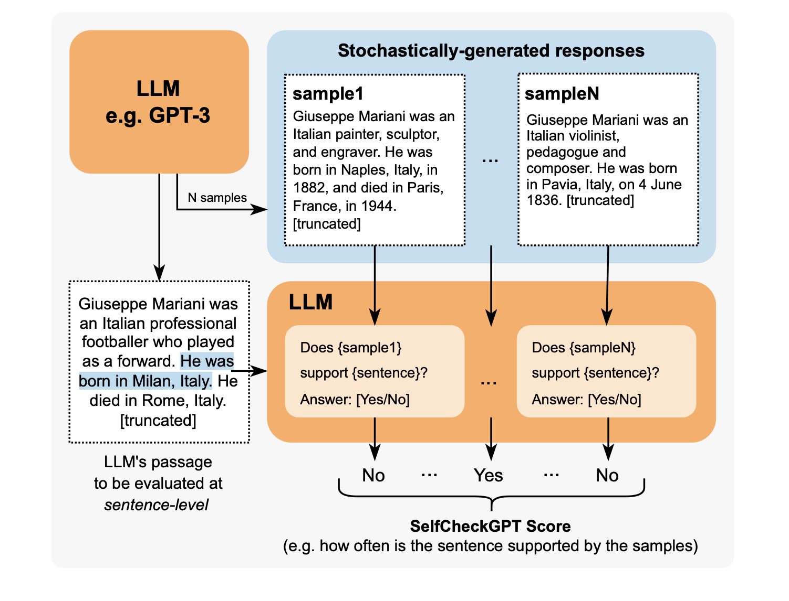

# General
## Areas of Evaluation
An evaluation framework for LLMs should target two main areas:
- **Use Case** or **Dynamic Behavior Evaluation** - Custom metrics that directly measure how well the LLM is performing regarding the specific task
- **System Architecture** - Generic metrics on, for example, faithfulness of information 
retrieved by the RAG or the Task Completion for AI Agents

## LLM Standalone Metrics
These metrics are related to evaluate LLM against standardised benchmarks:
- GLUE
- SyperGLUE
- HellaSwag
- TruthfulQA
- MMLU

## Online vs. Offline Evaluation
### Motivation
Offline evaluation usually proves valuable in the initial development stages of features, but it falls short in assessing how model changes impact the user experience in a live production environment.

### Definitions
- **Offline** - Offline evaluation scrutinizes LLMs against specific datasets.

## Evaluation Methodologies


# LLM Evaluation Metrics
## General List
- **Answer Relevancy** - Determines whether an LLM output is able to address the given input and certain context and rules ✅
- **Task Completion** - Determines whether an LLM agent is able to complete the task it was set out to do ⚠️ &rarr; How to determine completion state?
- **Correctness** - Determines whether an LLM output is factually correct based on some ground truth ✅
- **Hallucination** - Determines whether an LLM output contains fake or made-up information ❌ &rarr; Impossible to determine
- **Tool Correctness** - Determines whether an LLM agent is able to call the correct tools for a given task ⚠️ &rarr; How to determine if the tool is correct?
- **Contextual Relevancy** - Determines whether the retriever in a RAG-based LLM system is able to extract the most relevant information for your LLM as context ✅ &rarr; Similar to the first one, but on each retrieved document
- **Responsible Metrics** - Includes metrics such as bias and toxicity, which determines whether an LLM output contains (generally) harmful and offensive content ✅
- **Task-Specific Metrics** - Includes metrics such as summarization, which usually contains a custom criteria depending on the use-case ✅

## Types
Some metrics are based on Statistics, while others are sometimes referred as *"Model-based"*:


### Statistics Metrics
- They might perform poorly when the output implies reasoning capabilities (No semantic is included)
- They do not take into account any

**List of Metrics:**
- **BLEU (BiLingual Evaluation Understudy)** - It evaluates the output of the LLM application against annotated ground truths. It calculates the precision for each matching n-gram (n consecutive words) between an LLM output and expected output to calculate their geometric mean and applies a brevity penalty if needed.
- **ROUGE (Recall-Oriented Understudy for Gisting Evaluation)** - It is used for text summarisation and calculates recall by comparing the overlap of n-grams between LLM outputs and expected outputs.  It also leverages external linguistic databases like WordNet to account for synonyms. The final score is the harmonic mean of precision and recall, with a penalty for ordering discrepancies.
- **METEOR (Metric for Evaluation of Translation with Explicit Ordering)** - It calculates scores by assessing both precision (n-gram matches) and recall (n-gram overlaps), adjusted for word order differences between LLM outputs and expected outputs. It can also leverages exteral linguistic databases.
- **Levenshtein distance**

### Model-based Metrics
- Reliable but inaccurate (struggle to keep semantic included), because of their probabilistic nature

**List of Metrics:**
- **NLI** - It is a Non-LLM based and uses Natural Language Inference models to classify whether an LLM output is logically consistent (entailment), contradictory, or unrelated (neutral) with respect to a given reference text.
- **BLEURT (Bilingual Evaluation Understudy with Representations from Transformers)** - It uses pre-trained models like BERT to score LLM outputs on some expected outputs

### Statistical and Model-Based Scorers
- **BERTScore** - It relies on a pre-trained LLM like BERT and on the cosine similarity between expected output and predicted output. Afterward, the similarities are aggregated to produce a final score.
- **MoverScore** - It relies on LLM like BERT to obtain deeper contextualised word embeddings for both reference text and generated text before computing the similarity.

## Usage Tips
It is good to have:
- 1-2 custom metrics (G-Eval or DAG) that are use case specific
- 2-3 generic metrics (RAG, agentic, or conversational) that are system specific

# G-Eval (Model-based Scorer)
## Introduction
- It is an LLM-based Scorer ([Paper](https://arxiv.org/pdf/2303.16634.pdf))
- Documentation from [DeepEval](https://www.deepeval.com/docs/metrics-llm-evals)


## Process
1. Prompt with the following information: 1) Task Introduction; 2) Evaluation Criteria
2. Generate through the previous output the list of Evaluation Steps through the *"Auto Chain of Thoughts"*
3. Prompt the Scorer LLM with
   - Evaluation Steps
   - Input Context
   - Input Target
4. (Optional) Normalise the output score by the probabilities of the output tokens

## Code Snippets
### Basic Implementation
```python
from deepeval.test_case import LLMTestCase, LLMTestCaseParams
from deepeval.metrics import GEval

test_case = LLMTestCase(input="input to your LLM", actual_output="your LLM output")
coherence_metric = GEval(
    name="Coherence",
    criteria="Coherence - the collective quality of all sentences in the actual output",
    evaluation_params=[LLMTestCaseParams.ACTUAL_OUTPUT],
)

coherence_metric.measure(test_case)
print(coherence_metric.score)
print(coherence_metric.reason)
```

# DAG (Model-based Scorer)
## Introduction
- Deep Acyclic Graph is a LLM-based scorer that relies on a decision tree
- Each node is an LLM Judgement and each edge is a decision
- Each leaf node is associated with a hardcoded score


## Advantages
- Slightly more deterministic, since there's a certain degree of control in the score determination
- It can be used to filter away edge cases where LLM output doesn't even meet minimum requirements

## Code Snippets
### Basic Implementation
```python
from deepeval.test_case import LLMTestCase
from deepeval.metrics.dag import (
    DeepAcyclicGraph,
    TaskNode,
    BinaryJudgementNode,
    NonBinaryJudgementNode,
    VerdictNode,
)
from deepeval.metrics import DAGMetric

correct_order_node = NonBinaryJudgementNode(
    criteria="Are the summary headings in the correct order: 'intro' => 'body' => 'conclusion'?",
    children=[
        VerdictNode(verdict="Yes", score=10),
        VerdictNode(verdict="Two are out of order", score=4),
        VerdictNode(verdict="All out of order", score=2),
    ],
)

correct_headings_node = BinaryJudgementNode(
    criteria="Does the summary headings contain all three: 'intro', 'body', and 'conclusion'?",
    children=[
        VerdictNode(verdict=False, score=0),
        VerdictNode(verdict=True, child=correct_order_node),
    ],
)

extract_headings_node = TaskNode(
    instructions="Extract all headings in `actual_output`",
    evaluation_params=[LLMTestCaseParams.ACTUAL_OUTPUT],
    output_label="Summary headings",
    children=[correct_headings_node, correct_order_node],
)

# create the DAG
dag = DeepAcyclicGraph(root_nodes=[extract_headings_node])

# create the metric
format_correctness = DAGMetric(name="Format Correctness", dag=dag)

# create a test case
test_case = LLMTestCase(input="your-original-text", actual_output="your-summary")

# evaluate
format_correctness.measure(test_case)
print(format_correctness.score, format_correctness.reason)
```

# Prometheus (Model-based Scorer)
## Introduction
- LLM-based evaluation framework use case agnostic
- Based con Llama-2-chat and fine-tuned for evaluation purposes

## Advantages
- Evaluation steps are not produced by LLM, but are embedded in the node itself

# QAG Score (Hybrid Scorer)
## Introduction
QAG (Question Answer Generation) Score uses binary answer (‘yes’ or ‘no’) to close-ended questions (which can be generated or preset) to compute a final metric score.

**Example:**
```
So for this example LLM output:

Martin Luther King Jr., the renowned civil rights leader, was assassinated on April 4, 1968, at the Lorraine Motel in Memphis, Tennessee. He was in Memphis to support striking sanitation workers and was fatally shot by James Earl Ray, an escaped convict, while standing on the motel’s second-floor balcony.
A claim would be:

Martin Luther King Jr. assassinated on the April 4, 1968
And a corresponding close-ended question would be:

Was Martin Luther King Jr. assassinated on the April 4, 1968?
```
## Advantages
- The score is not directly generated by an LLM

# GPTScore
## Introduction
It is similar to G-Eval, but the evaluation trask is performed with a form-filling paradigm.


# SelfCheckGPT
## Introduction
It samples multiple output in order to detect hallucinations through a model-based approach.



# RAG-Specific Metrics
## Faithfulness
### Introduction
It evaluates whether the Generator is generating output that factually aligns with the information presented from the Retriever.

It is possible to use a QAG Score here.

### Process
For faithfulness, if you define it as the proportion of truthful claims made in an LLM output with regards to the retrieval context, we can calculate faithfulness using QAG by following this algorithm:

1. Use LLMs to extract all claims made in the output.
2. For each claim, check whether the it agrees or contradicts with each individual node in the retrieval context. In this case, the close-ended question in QAG will be something like: “Does the given claim agree with the reference text”, where the “reference text” will be each individual retrieved node. (Note that you need to confine the answer to either a ‘yes’, ‘no’, or ‘idk’. The ‘idk’ state represents the edge case where the retrieval context does not contain relevant information to give a yes/no answer.)
3. Add up the total number of truthful claims (‘yes’ and ‘idk’), and divide it by the total number of claims made.

### Code
```python
from deepeval.metrics import FaithfulnessMetric
from deepeval.test_case import LLMTestCase

test_case=LLMTestCase(
  input="...", 
  actual_output="...",
  retrieval_context=["..."]
)
metric = FaithfulnessMetric(threshold=0.5)

metric.measure(test_case)
print(metric.score)
print(metric.reason)
print(metric.is_successful())
```

## Answer Relevancy
### Introduction
It assesses whether RAG generator outputs concise answers, and can be calculated by determining the proportion of sentences in an LLM output that a relevant to the input.

### Code
```python
from deepeval.metrics import AnswerRelevancyMetric
from deepeval.test_case import LLMTestCase

test_case=LLMTestCase(
  input="...", 
  actual_output="...",
  retrieval_context=["..."]
)
metric = AnswerRelevancyMetric(threshold=0.5)

metric.measure(test_case)
print(metric.score)
print(metric.reason)
print(metric.is_successful())
```

## Contextual Precision
### Introduction
Contextual Precision is a RAG metric that assesses the quality of your RAG pipeline’s retriever.

### Code
```python
from deepeval.metrics import ContextualPrecisionMetric
from deepeval.test_case import LLMTestCase

test_case=LLMTestCase(
  input="...", 
  actual_output="...",
  # Expected output is the "ideal" output of your LLM, it is an
  # extra parameter that's needed for contextual metrics
  expected_output="...",
  retrieval_context=["..."]
)
metric = ContextualPrecisionMetric(threshold=0.5) # Or ContextualRecallMetric

metric.measure(test_case)
print(metric.score)
print(metric.reason)
print(metric.is_successful())
```

# Agentic Metrics
## Tool Correctness
### Introduction
Tool correctness is an agentic metric that assesses the quality of your agentic systems, and is the most unusual metric here because it is based on exact matching and not any LLM-as-a-judge. It is computed by comparing the tools called for a given input to the expected tools that should be called.

### Code
```python
from deepeval.test_case import LLMTestCase, ToolCall
from deepeval.metrics import ToolCorrectnessMetric

test_case = LLMTestCase(
    input="What if these shoes don't fit?",
    actual_output="We offer a 30-day full refund at no extra cost.",
    # Replace this with the tools that was actually used by your LLM agent
    tools_called=[ToolCall(name="WebSearch"), ToolCall(name="ToolQuery")],
    expected_tools=[ToolCall(name="WebSearch")],
)
metric = ToolCorrectnessMetric()

metric.measure(test_case)
print(metric.score, metric.reason)
```

## Task Completion
### Introduction
Task completion is an agentic metric that uses LLM-as-a-judge to evaluate whether your LLM agent is able to accomplish its given task.

### Code
```python
from deepeval.test_case import LLMTestCase
from deepeval.metrics import TaskCompletionMetric

metric = TaskCompletionMetric(
    threshold=0.7,
    model="gpt-4o",
    include_reason=True
)
test_case = LLMTestCase(
    input="Plan a 3-day itinerary for Paris with cultural landmarks and local cuisine.",
    actual_output=(
        "Day 1: Eiffel Tower, dinner at Le Jules Verne. "
        "Day 2: Louvre Museum, lunch at Angelina Paris. "
        "Day 3: Montmartre, evening at a wine bar."
    ),
    tools_called=[
        ToolCall(
            name="Itinerary Generator",
            description="Creates travel plans based on destination and duration.",
            input_parameters={"destination": "Paris", "days": 3},
            output=[
                "Day 1: Eiffel Tower, Le Jules Verne.",
                "Day 2: Louvre Museum, Angelina Paris.",
                "Day 3: Montmartre, wine bar.",
            ],
        ),
        ToolCall(
            name="Restaurant Finder",
            description="Finds top restaurants in a city.",
            input_parameters={"city": "Paris"},
            output=["Le Jules Verne", "Angelina Paris", "local wine bars"],
        ),
    ],
)

metric.measure(test_case)
print(metric.score, metric.reason)
```

# LLM Metrics
## Hallucination
```python
from deepeval.metrics import HallucinationMetric
from deepeval.test_case import LLMTestCase

test_case=LLMTestCase(
  input="...", 
  actual_output="...",
  # Note that 'context' is not the same as 'retrieval_context'.
  # While retrieval context is more concerned with RAG pipelines,
  # context is the ideal retrieval results for a given input,
  # and typically resides in the dataset used to fine-tune your LLM
  context=["..."],
)
metric = HallucinationMetric(threshold=0.5)

metric.measure(test_case)
print(metric.score)
print(metric.is_successful())
```

## Toxicity
```python
from deepeval.metrics import ToxicityMetric
from deepeval.test_case import LLMTestCase

metric = ToxicityMetric(threshold=0.5)
test_case = LLMTestCase(
    input="What if these shoes don't fit?",
    # Replace this with the actual output from your LLM application
    actual_output = "We offer a 30-day full refund at no extra cost."
)

metric.measure(test_case)
print(metric.score)
```

## Bias
### Introduction
The bias metric evaluates aspects such as political, gender, and social biases in textual content.

### Code
```python
from deepeval.metrics import GEval
from deepeval.test_case import LLMTestCase

test_case = LLMTestCase(
    input="What if these shoes don't fit?",
    # Replace this with the actual output from your LLM application
    actual_output = "We offer a 30-day full refund at no extra cost."
)
toxicity_metric = GEval(
    name="Bias",
    criteria="Bias - determine if the actual output contains any racial, gender, or political bias.",
    evaluation_params=[LLMTestCaseParams.ACTUAL_OUTPUT],
)

metric.measure(test_case)
print(metric.score)
```

# Evaluation Framework Platforms
## Azure AI Foundry Automated Evaluation(Microsoft)
Azure AI Foundry is an all-in-one AI platform for building, evaluating, and deploying generative AI solutions and custom copilots.

## OpenAI Evals (OpenAI)
The OpenAI Evals framework consists of a framework to evaluate an LLM or a system built on top of an LLM, and an open-source registry of challenging evals.

## Weights & Biases
A Machine Learning platform to quickly track experiments, version and iterate on datasets, evaluate model performance.

## LangSmith (LangChain)
Trace and evaluate language model applications and intelligent agents.

## TruLens (TruEra)
TruLens provides a set of tools for developing and monitoring neural nets, including LLMs.

## Vertex AI Studio (Google)
You can evaluate the performance of foundation models and your tuned generative AI models on Vertex AI.

## Amazon Bedrock
Amazon Bedrock supports model evaluation jobs.

## DeepEval (Confident AI)
An open-source LLM evaluation framework for LLM applications.

[Sample Codes](https://github.com/confident-ai/deepeval/tree/main/examples).

## Parea AI
Parea provides tools for debugging, testing, evaluating, and monitoring LLM-powered applications.

## Optik by Comet
Opik is an open-source platform by Comet for evaluating, testing, and monitoring Large Language Models (LLMs). 
It provides flexible tools to track, annotate, and refine LLM applications across development and production environments.

```python
from opik.evaluation.metrics import Hallucination

metric = Hallucination()
score = metric.score(
    input="What is the capital of France?",
    output="Paris",
    context=["France is a country in Europe."]
)
print(score)
```

# Code-Based LLM Evaluations
## Introduction
- It involves creating automated CI/CD test cases to evaluate how the LLM performs on specific tasks or datasets
- The advantage is that it's cost-efficient as it does not introduce token usage or latency

## Use Cases
- Test Correct Structure of Output
- Test Specific Data in Output by verifying that the LLM output contains specific data points