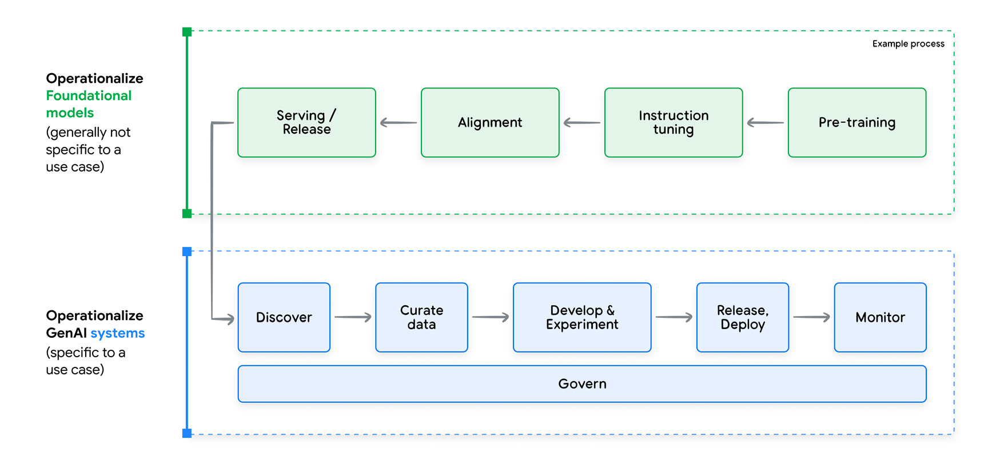

# LLMOps
## GenAI Development Lifecycle
It is composed by 5 steps or phases:

- **Discovery** - Explore landscape of available models to identify the most suitable one for their specific gen AI
application.
- **Development and Experimentation** - Techniques like prompt engineering, few-shot learning or PEFT.
- **Deployment** - It needs many new artifacts in the deployment process, including
prompt templates, chain definitions, embedding models, retrieval data stores, and fine-tuned
model adapters among others.
- **Continuous Monitoring**
- **Continuous Improvement** - It requires taking foundation models (FMs) and then adapting them to our specific use case.
Traditional continuous training still holds relevance for scenarios when recurrent 
fine-tuning or incorporating human feedback loops are still needed.

## Discovery
The current AI Landscape has:

1. An abundance of models
2. No model can fit all solutions

Here are some factors to consider when exploring models:

1. Quality: Early assessments can involve running test prompts or analyzing public
benchmarks and metrics to gauge output quality.
2. Latency & throughput: These factors directly impact user experience. A chatbot
demands lower latency than batch-processed summarization tasks.
3. Development & maintenance time: Consider the time investment for both initial
development and ongoing maintenance. Managed models often require less effort than
self-deployed open-source alternatives.
4. Usage cost: Factor in infrastructure and consumption costs associated with using the
chosen model.
5. Compliance: Assess the model's ability to adhere to relevant regulations and
licensing terms.

## Development and Experimentation
### Definition
It involves experimental iterations composed by three steps:

1. Data Refinement
2. Foundation model selection and adaptation
3. Evaluation

### Foundational Model
Foundation models differ from predictive models most importantly because they are multi-
purpose models.

Foundation models also exhibit what are known as ‘emergent properties’,2 capabilities that
emerge in response to specific input without additional training. Predictive models are
only able to perform the single function they were trained for; a traditional French-English
translation model, for instance, cannot also solve math problems.

Foundation models are also highly sensitive to changes in their input. A foundation model can be made to perform translation, generation, or classificatio
tasks simply by changing the input.

These new properties of foundation models have created a corresponding paradigm shift
in the practices required to develop and operationalize Gen AI systems. While models in
the predictive AI context are self-sufficient and task-specific, gen AI models are multipurpose
and need an additional element beyond the user input to function as part of a
gen AI Application: a prompt, and more specifically, a prompt template, defined as a set of
instructions and examples along with placeholders to accommodate user input.

## MLOps for GenAI or LLMops
### Definition
GenAI models are usually a chain of agents, which characteristic presents few more challenges with respect to traditional MLOps.

### Aspects
1. Evaluation - Because of their tight coupling, chains need end-to-end evaluation, not just
on a per-component basis, to gauge their overall performance and the quality of their
output.
2. Versioning - A chain needs to be managed as a complete artifact in its entirety. The chain
configuration should be tracked with its own revision history for analysis, reproducibility,
and understanding the impact of changes on output.
3. Continuous Monitoring - It is used for detecting
performance degradation, data drift, or unexpected behavior in the chain.
4. Introspection - The ability to inspect the internal data flows of a chain (inputs and outputs
from each component) as well as the inputs and outputs of the entire chain is paramount.

## Continuous Training & Tuning
### Definition
In machine learning operations (MLOps), continuous training is the practice of repeatedly
retraining machine learning models in a production environment.

For gen AI models, continuous tuning of the models is often more practical than
retraining from scratch due to the high data and computational costs involved.

### Data Requirements
This ease of prototyping, however, comes with a challenge. Traditional predictive AI relies on
apriori well-defined dataset(s). In gen AI, a single application can leverage various data types,
from completely different data sources, all working together (Figure 10). Let’s explore some
of these data types:

1. Conditioning Prompts - System prompts or Contextual prompts
2. Few-shot Examples - Input-output pairs
3. Grounding/Augmentation Data - Data coming from external sources to help the model crafting the output
4. Task-specific Datasets - Used for fine-tuning
5. Human Preference Datasets - Used for RLHF
6. Full Pre Training Corpora - Dataset for pre-training

## Deploy
### Introduction
We need to distinguish between deployment of:
- Foundation Models
- Generative AI Systems

### Generative AI Systems
Versioning:

- Prompt template
- Chain definition
- External datasets
- Adapter models

### Foundation Models
**Infrastructure Validation**
This refers to the introduction of an additional verification step, prior
to deploying the training and serving systems, to check both the compatibility of the model
with the defined serving configuration and the availability of the required hardware.

**Compression**
Another way of addressing infrastructure challenges is to optimize the model itself.
Compressing and/or optimizing the model can often significantly reduce the storage and
compute resources needed for training and serving, and in many cases can also decrease
the serving latency.
Some techniques for model compression and optimization include quantization, distillation
and model pruning. Quantization reduces the size and computational requirements of the
model by converting its weights and activations from higher-precision floating-point numbers
to lower-precision representations, such as 8-bit integers or 16-bit floating-point numbers.
This can significantly reduce the memory footprint and computational overhead of the model.
Model Pruning is a technique for eliminating unnecessary weight parameters or by selecting
only important subnetworks within the model. This reduces model size while maintaining
accuracy as high as possible. Finally, distillation trains a smaller model, using the responses
generated by a larger LLM, to reproduce the output of the larger LLM for a specific domain.
This can significantly reduce the amount of training data, compute, and storage resources
needed for the application.

## Monitoring
### Introduction
Monitoring can be applied to the overall gen AI application and to individual components. We
prioritize monitoring at the application level. This is because if the application is performan
and monitoring proves that, it implies that all components are also performant. You can also
apply the same practices to each of the prompted model components to get more granular
results and understanding of your application.

### Skew Detection
Skew detection in traditional ML systems refers to training-serving skew that occurs when
the feature data distribution in production deviates from the feature data distribution
observed during model training. In the case of Gen AI systems using pretrained models in
components chained together to produce the output, we need to modify our approach. We
can measure skew by comparing the distribution of the input data we used to evaluate our
application (the test set as described under the Data Curation and Principles section above)
and the distribution of the inputs to our application in production.

### Drift Detection
Like skew detection, the drift detection process checks for statistical differences between
two datasets. However, instead of comparing evaluations and serving inputs, drift looks for
changes in input data. This allows you to check how the inputs and therefore the behavior of
your users changed over time.

Given that the input to the application is typically text, there are a few approaches to
measuring skew and drift.

Some common approaches are calculating  embeddings and distances, counting text length
and number of tokens, and tracking vocabulary changes, new concepts and intents, 
prompts and topics in datasets, as well as statistical approaches such as least-squares
density difference, maximum mean discrepancy (MMD), learned kernel MMD, or context-aware MMD.
