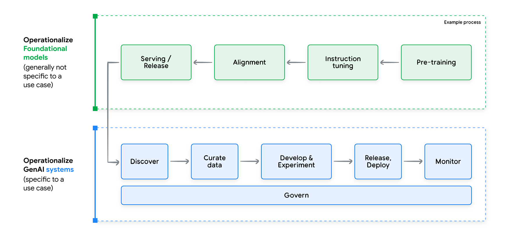

# GenAI Development Lifecycle
## Introduction
It is composed by 5 steps or phases:
- **Discovery** - Explore landscape of available models to identify the most suitable one for their specific gen AI
application.
- **Development and Experimentation** - Techniques like prompt engineering, few-shot learning or PEFT.
- **Deployment** - It needs many new artifacts in the deployment process, including
prompt templates, chain definitions, embedding models, retrieval data stores, and fine-tuned
model adapters among others.
- **Continuous Monitoring**
- **Continuous Improvement** - It requires taking foundation models (FMs) and then adapting them to our specific use case.
Traditional continuous training still holds relevance for scenarios when recurrent 
fine-tuning or incorporating human feedback loops are still needed.

## Discovery
Current AI Landscape has:
1. An abundance of models
2. No model can fit all solutions

Here are some factors to consider when exploring models:
1. Quality: Early assessments can involve running test prompts or analyzing public
benchmarks and metrics to gauge output quality.
2. Latency & throughput: These factors directly impact user experience. A chatbot
demands lower latency than batch-processed summarization tasks.
3. Development & maintenance time: Consider the time investment for both initial
development and ongoing maintenance. Managed models often require less effort than
self-deployed open-source alternatives.
4. Usage cost: Factor in infrastructure and consumption costs associated with using the
chosen model.
5. Compliance: Assess the model's ability to adhere to relevant regulations and
licensing terms.

## Development and Experimentation
### Definition
It involves experimental iterations composed by three steps:
1. Data Refinement
2. Foundation model selection and adaptation
3. Evaluation

### Foundational Model
Foundation models differ from predictive models most importantly because they are multi-
purpose models.

Foundation models also exhibit what are known as ‘emergent properties’,2 capabilities that
emerge in response to specific input without additional training. Predictive models are
only able to perform the single function they were trained for; a traditional French-English
translation model, for instance, cannot also solve math problems.

Foundation models are also highly sensitive to changes in their input. A foundation model can be made to perform translation, generation, or classificatio
tasks simply by changing the input.

These new properties of foundation models have created a corresponding paradigm shift
in the practices required to develop and operationalize Gen AI systems. While models in
the predictive AI context are self-sufficient and task-specific, gen AI models are multipurpose
and need an additional element beyond the user input to function as part of a
gen AI Application: a prompt, and more specifically, a prompt template, defined as a set of
instructions and examples along with placeholders to accommodate user input.

# MLOps for GenAI or LLMops
## Definition
GenAI models are usually a chain of agents, which characteristic presents few more challenges with respect to traditional MLOps.

## Aspects
1. Evaluation