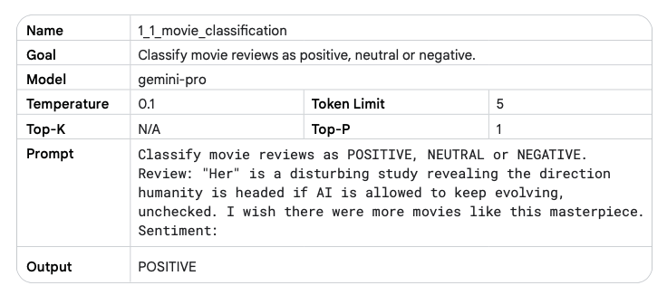
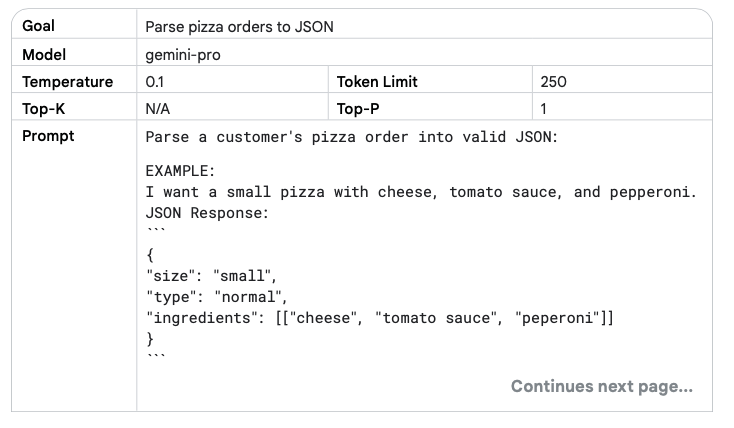
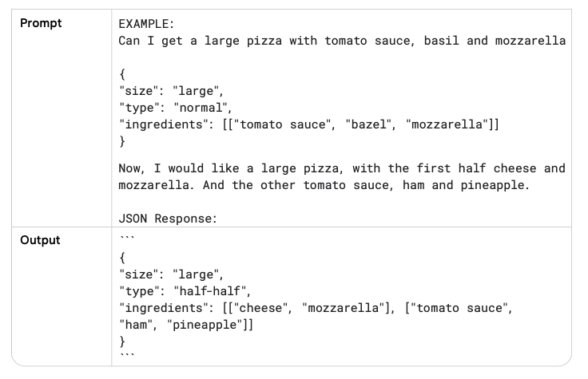
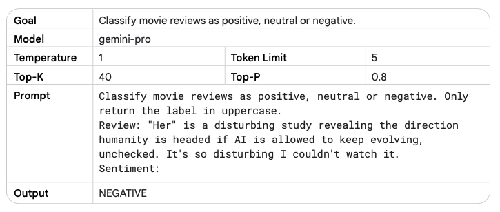
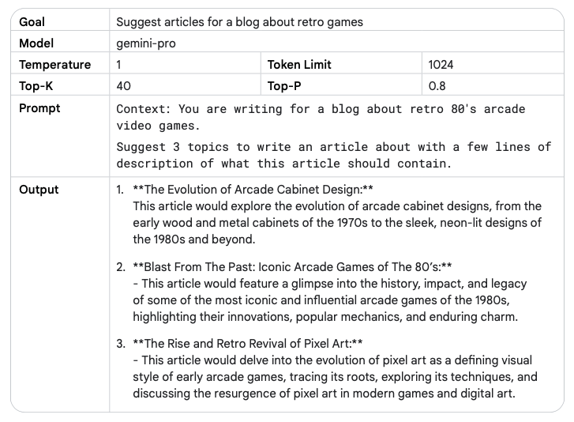
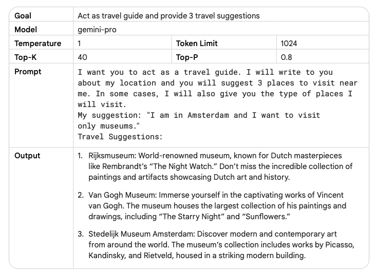
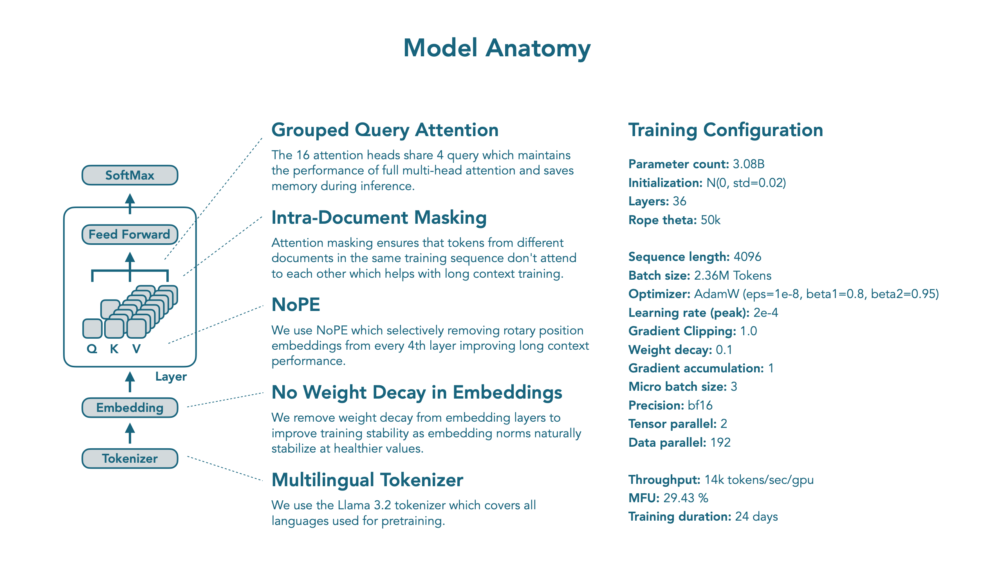

# LLMs
## Alignment Process
### Definition
Usually, a LLM goes through the following two training steps:

- Pre-training
- Fine-Tuning

The *Alignment* process is used in order to collect feedbacks of users regarding a particular LLM's output 
and decide which is better.

### Example
1. Pre-Training phase
2. Fine-Tuning phase &rarr; *"Is pineapple on Pizza a Crime?"* &rarr; *"Putting pineapple on a Pizza violates the Geneva convention etc."*
3. Alignment phase &rarr; Use the user's feedbacks

## Prompting
### Definition
Usually called also "Prompt Engineering", it is the process of crafting a good prompt for the desired purpose.

### Types
- **Zero-Shot Prompting** - Ask the LLM to solve a problem without previous reference or example



- **Few-Shot Prompting** - Provide few examples on how to solve the problem and then ask




- **Chain-of-Thought Prompting** - Guide the LLM through the entire process it has to do to solve the problem

### System, Contextual and Role Prompting
System, contextual and role prompting are all techniques used to guide how LLMs generate text, but they focus on different aspects:

- **System prompting** sets the overall context and purpose for the language model. 
It defines the ‘big picture’ of what the model should be doing, like translating a language, classifying a review etc.



- **Contextual prompting** provides specific details or background information relevant to the current conversation or task. 
It helps the model to understand the nuances of what’s being asked and tailor the response accordingly.



- **Role prompting** assigns a specific character or identity for the language model to adopt. 
This helps the model generate responses that are consistent with the assigned role and its associated knowledge and behavior.



### Techniques
#### Step-back prompting
Step-back prompting is a technique for improving the performance by prompting the LLM to first 
consider a general question related to the specific task at hand, and then feeding the answer to that general 
question into a subsequent prompt for the specific task. This ‘step back’ allows the LLM to activate relevant 
background knowledge and reasoning processes before attempting to solve the specific problem.

Examples:

- Write a one paragraph storyline for a new level of a first-person shooter video game that is challenging and engaging.
- Based on popular first-person shooter action games, what are
5 fictional key settings that contribute to a challenging and engaging level storyline in a first-person shooter video game?

#### Self-Consistency
It follows the following steps:

1. Generating diverse reasoning paths: The LLM is provided with the same prompt multiple times. 
A high temperature setting encourages the model to generate different reasoning paths and perspectives on the problem.
2. Extract the answer from each generated response.
3. Choose the most common answer.

#### Tree of Thoughts (ToT)
It generalizes the concept of CoT prompting because it allows LLMs to explore multiple different reasoning paths 
simultaneously, rather than just following a single linear chain of thought.

#### ReAct (reason & act)
LLM to perform certain actions, such as interacting with external APIs to retrieve information which is a first step 
towards agent modeling.
ReAct mimics how humans operate in the real world.

```python
from langchain.agents import load_tools
from langchain.agents import initialize_agent
from langchain.agents import AgentType
from langchain.llms import VertexAI
prompt = "How many kids do the band members of Metallica have?"
llm = VertexAI(temperature=0.1)
tools = load_tools(["serpapi"], llm=llm)
agent = initialize_agent(tools, llm,
agent=AgentType.ZERO_SHOT_REACT_DESCRIPTION, verbose=True)
agent.run(prompt)
```

## Inference
### Process
There’s a common misconception that LLMs like GPT-2 directly produce text. 
This isn’t the case. Instead, LLMs calculate logits, which are scores assigned to every possible token in their vocabulary. 
To simplify, here’s an illustrative breakdown of the process:


The LLM produces just logits of the most probable tokens. Then we have the so called "Decoding" process, which will choose
the token to sample through different Sampling Techniques.

### Sampling Techniques
How to choose which is the best output token?

#### Greedy Search
It samples the most probable token each time. Once the token is sampled, it is then added to the input sequence.


#### Beam Search

#### Random Sampling
Selects the next token according to the probability distribution, where each token is sampled 
proportionally to its predicted probability.

#### Temperature Sampling
Adjusts the probability distribution by a temperature parameter. 
Higher temperatures promote diversity, lower temperatures favor high-probability tokens.

#### Top-K sampling
Randomly samples from the top K most probable tokens.

### Performance
There are several ways to make the inference process more performing:

1. Quantisation - It uses lower precision memory in order to not lose many
2. Distillation - Train a smaller model

### Parameters
1. Output Length - It's the number of tokens
2. Temperature - Temperature controls the degree of randomness in token selection. Lower temperatures
are good for prompts that expect a more deterministic response, while higher temperatures can lead to more diverse or unexpected results.
3. Top-K - Sampling selects the top K most likely tokens from the model’s predicted distribution.
4. Top-P - Sampling selects the top tokens whose cumulative probability does not exceed a certain value (P).

Considerations:

1. If you set temperature to 0, top-K and top-P become irrelevant–the most probable token becomes the next token predicted. 
If you set temperature extremely high (above 1–generally into the 10s), temperature becomes irrelevant and whatever tokens make
it through the top-K and/or top-P criteria are then randomly sampled to choose a next predicted token.
2. If you set top-K to 1, temperature and top-P become irrelevant. Only one token passes the top-K criteria, 
and that token is the next predicted token. If you set top-K extremely high, like to the size of the LLM’s vocabulary, 
any token with a nonzero probability of being the next token will meet the top-K criteria and none are selected out.
3. If you set top-P to 0 (or a very small value), most LLM sampling implementations will then only consider the most 
probable token to meet the top-P criteria, making temperature and top-K irrelevant. If you set top-P to 1, any token 
with a nonzero probability of being the next token will meet the top-P criteria, and none are selected out.

## Mistral
### Chat Template
Since one of the most common use case for LLMs is chat, rather than continuing a single string of text, 
the model instead continues a conversation.

Mistral uses a specific chat template called [ChatML](https://huggingface.co/docs/transformers/chat_templating).

Much like tokenization, different models expect very different input formats for chat. 
This is the reason for chat templates as a feature. 
Chat templates are part of the tokenizer. 
They specify how to convert conversations, represented as lists of messages, 
into a single tokenizable string in the format that the model expects.

## SmolLM3
### Architecture



Composition:
- Tokenizer 
- Embeddings