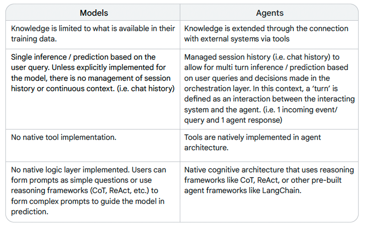
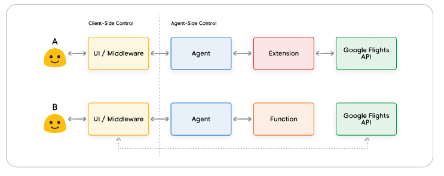

# Introduction
## Definition
Agents are Generative AI models that can be trained to use tools
to access real-time information or suggest a real-world action.

This combination of reasoning, logic, and access to external information
that are all connected to a Generative AI model invokes the concept of an agent, or a
program that extends beyond the standalone capabilities of a Generative AI model.

A Generative AI agent can be defined as an application that
attempts to achieve a goal by observing the world and acting upon it using the tools that it
has at its disposal.


## Agents vs. Models



# Architecture
## Structure
An agent is composed by three main components:
- The Model - It's a LLM that acts as a centralised decision maker, thanks to techniques as ReAct, Chain-of-Thought or Tree-of-Thought
- The Tools - Foundational models remain constrained by their inability to interact with the outside world. Tools bridge this gap (e.g., RAG).
- The Orchestration Layer - The orchestration layer describes a cyclical process that governs how the agent takes in
information, performs some internal reasoning, and uses that reasoning to inform its next
action or decision. It performs this loop until the end goal is reached.

## Process
The sequence of events might go something like this:
1. User sends query to the agent
2. Agent begins the ReAct sequence
3. The agent provides a prompt to the model, asking it to generate one of the next ReAct
steps and its corresponding output:

   a. **Question**: The input question from the user query, provided with the prompt 

   b. **Thought**: The model’s thoughts about what it should do next c. Action: The model’s decision on what action to take next

   c. **Action**: The model's decision on what action to take next

       i. This is where tool choice can occur

       ii. For example, an action could be one of [Flights, Search, Code, None], where the first
       3 represent a known tool that the model can choose, and the last represents “no
       tool choice”

   d. **Action Input**: The model's decision on what inputs to provide to the tool (if any)

   e. **Observation**: The result of the action / action input sequence

       i. This though / action / action input / observation could repeat N-times as needed

   f. **Final Answer**: The model's final answer to provide to the original user query
4. The ReAct loop concludes and a final answer is provided back ot the user

# Tools
## Introduction
While language models excel at processing information, they lack the ability to directly
perceive and influence the real world.

So how can we empower our models to have real-time, context-aware interaction with
external systems? Functions, Extensions, Data Stores and Plugins are all ways to provide this
critical capability to the model.

There are three main primary tools:
- Extensions
- Functions
- Data Stores

## Extensions
Extensions allow agents to seamlessly execute APIs
regardless of their underlying implementation. Let’s say that you’ve built an agent with a goal
of helping users book flights. You know that you want to use the Google Flights API to retrieve
flight information, but you’re not sure how you’re going to get your agent to make calls to this
API endpoint. 

One approach could be to implement custom code.
This approach is not scalable and could easily break
in any scenario that falls outside the implemented custom code.

A more resilient approach would be to use an Extension. An Extension bridges the gap
between an agent and an API by:
1. Teaching the agent how to use the API endpoint using examples.
2. Teaching the agent what arguments or parameters are needed to successfully call the
API endpoint.


```python
import vertexai
import pprint
from vertexai.preview.extensions import Extension

PROJECT_ID = "YOUR_PROJECT_ID"
REGION = "us-central1"

vertexai.init(project=PROJECT_ID, location=REGION)

extension_code_interpreter = Extension.from_hub("code_interpreter")
CODE_QUERY = """Write a python method to invert a binary tree in O(n) time."""

response = extension_code_interpreter.execute(
operation_id = "generate_and_execute",
operation_params = {"query": CODE_QUERY}
)

print("Generated Code:")
pprint.pprint({response['generated_code']})
```

## Functions
In the world of software engineering, functions are defined as self-contained modules
of code that accomplish a specific task and can be reused as needed.

Functions differ from Extensions in a few ways, most notably:
1. A model outputs a Function and its arguments, but doesn’t make a live API call.
2. Functions are executed on the client-side, while Extensions are executed on
the agent-side.

The logic and execution of calling the actual API endpoint is offloaded away
from the agent and back to the client-side. This offers the developer more granular control over the flow.

Common use cases:
- API calls need to be made at another layer of the application stack
- Security or authentication restrictions that prevent the agent from calling an API directly
- Additional data transformation logic needs to be applied to the API Response that the
agent cannot perform.



## Data Stores
Data Stores address this limitation by providing access to more dynamic
and up-to-date information, and ensuring a model’s responses remain grounded in factuality
and relevance.

In the context of Generative AI agents, Data Stores are typically implemented as a vector
database that the developer wants the agent to have access to at runtime.

