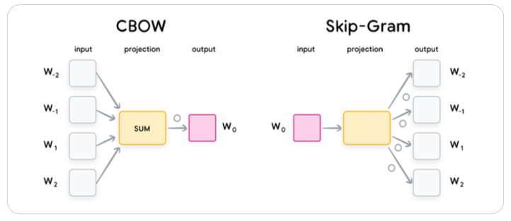
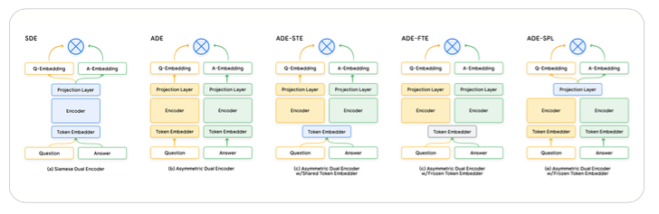

# General
## Definition
Embeddings are numerical representations of real-world data such as text,
speech, image, or videos. They are expressed as low-dimensional vectors where the
geometric distances of two vectors in the vector space is a projection of the relationships
between the two real-world objects that the vectors represent.

Such low dimensional representation try to preserve the most of the "essential information" of the
original objects.

Ideally the embeddings are created, so they place objects with similar semantic properties
closer in the embedding space.

The Embeddings are usually obtained through different ML models, like Encoder-based Transformers such as BERT.

## Usage
### Semantic Search
1. Precomputing the embeddings for billions items of the search space.
2. Mapping query embeddings to the same embedding space.
3. Efficient computing and retrieving of the nearest neighbors of the query embeddings in
the search space.

## Applications
- Retrieval
- Recommendations
- Features for ML Models

# Types of Embeddings
## Text Embeddings
### Definition
They are created through a process:
1. Tokenisation
2. indexing
3. Embedding

## Word Embeddings
### Usage
Word embeddings can be directly used in some downstream tasks like Named Entity
Recognition (NER).

### Technologies
- GloVe
- SWIVEL
- Word2Vec

### Word2Vec
Word2Vec is a family of model architectures that operates on the principle of “the semantic
meaning of a word is defined by its neighbors”.

It uses a matrix of shape (size_of_vocabulary, size_of_each_embedding). 
This matrix can be used as a lookup table after the training process is completed using one of the following methods:
- The Continuous bag of words (CBOW)  is fast to train and is slightly more accurate for frequent words.
- The skip-gram is inverse of that of CBOW, with the middle word
being used to predict the surrounding words within a certain range. This approach is
slower to train but works well with small data and is more accurate for rare words.

### GloVe
It uses a co-occurrence matrix, which represents the relationships between words. 
Then GloVe then uses a factorization technique to learn word representations
from the co-occurrence matrix.

### SWIVEL
Unlike GloVE, it uses local windows to learn the word vectors by taking into
account the co-occurrence of words within a fixed window of its neighboring words.

It is slightly less accurate than GloVe on average, but is considerably faster to train.

## Document Embeddings
### Definition
The evolution of the embeddings models can mainly be
categorized into two stages: shallow Bag-of-words (BoW) models and deeper pretrained
large language models (e.g., BERT).

### Shallow BoW Models
Early document embedding works follow the bag-of-words (BoW) paradigm, assuming a
document is an unordered collection of words. These early works include latent semantic
analysis (LSA)7 and latent dirichlet allocation (LDA).

Another famous bag-of-words family of document embeddings is TF-IDF.

It has two major weaknesses: both the word  ordering and the semantic meanings are ignored. 
BoW models fail to capture the sequential relationships between words.

## Image & Multimodal Embeddings
### Computation
Unimodal image embeddings can be derived in many ways: one of which is by training a
CNN or Vision Transformer model on a large scale image classification task (for example,
Imagenet), and then using the penultimate layer as the image embedding.

## Structured Data Embeddings
### Definition
Unlike unstructured data, where a pre-trained embedding model is typically available, we
have to create the embedding model for the structured data since it would be specific to
a particular application.

### General Computation
use dimensionality reductions techniques such as PCA.

## Graph Embeddings
### Definition
Graph embeddings are another embedding technique that lets you represent not
only information about a specific object but also its neighbors.

# Training
## Two Tower Architecture
Current embedding models usually use dual encoder (two tower) architecture. For example,
for the text embedding model used in question-answering, one tower is used to encode
the queries and the other tower is used to encode the documents.

The training includes a pretraining (unsupervised learning) and fine tuning (supervised
learning). Nowadays, the embedding models are usually directly initialized from foundation
models such as BERT, T5, GPT, Gemini, CoCa.