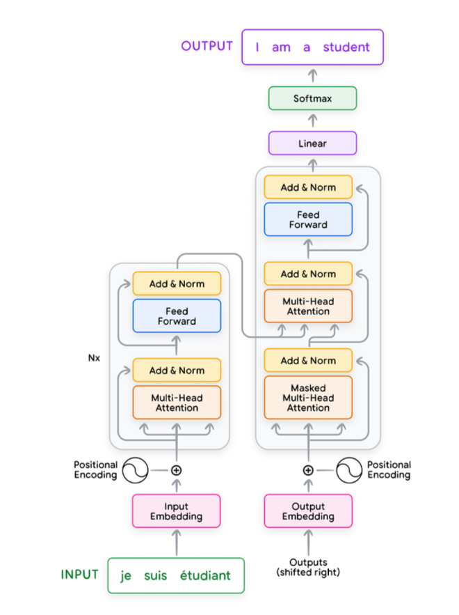
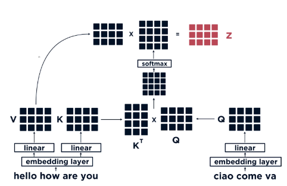
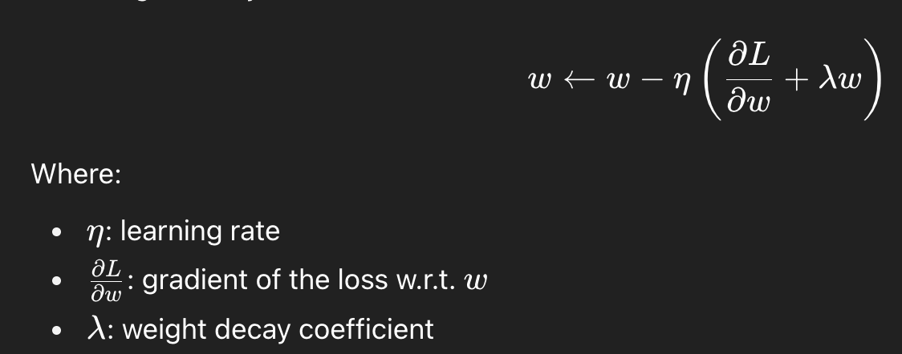
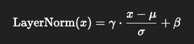

# Transformers
## History
Before the invention of transformers1, recurrent neural networks (RNNSs) were the popular approach for modeling sequences.
However, RNNs process input and output sequences sequentially, while Transformers can do it in parallel thanks to the
self-attention mechanism. Although the cost has highly increased (Quadratic of the context length).

Transformers are originally born for Natural Language Processing and, in particular, Translation problems.

### The Evolution of Transformers
- GPT-1 was a decoder-only that combined an unsupervised pre-training over a large amount of labelled data and
then fine-tuned for a specific task. The model was very limited, since it could generalise to tasks that are
similar to the task it was trained on.
- BERT which stands for Bidirectional Encoder Representations from Transformers, distinguishes itself 
from traditional encoder-decoder transformer models by being an encoder-only architecture. 
It was able to understand the context through an MLM training.
- GPT-2 was trained on a bigger dataset (40GB) and with 1.5B parameters. It was able to capture longer-range dependencies and common sense reasoning.

## Resources
- [The Illustrated Transformer](https://jalammar.github.io/illustrated-transformer/)
- [Attention is All You Need](https://arxiv.org/abs/1706.03762)

## Applications
The transformer architecture was developed at Google in 2017 for use in a translation model.
It’s a sequence-to-sequence model capable of converting sequences from one domain into sequences in another domains.

Other applications involve:

- **NLP** - The main area is for sure everything that concerns Natural Language Processing, where Transformers were born
- **CV** - Transformers have been also tested in Computer Vision field with promising results

## Process Overview
The Transformer can be seen as a sequence of different steps:

1. **Tokenization (NLP only)** &rarr; Convert raw text into a sequence of discrete tokens (e.g., words, subwords), often represented as integers &rarr; Output shape (sequence_length,)
2. **Embeddings** &rarr; Expand the input sequence representation in order to: a) Increase representatioin power; b) Matche the Encoder expected size &rarr; Output shape (sequence_length, d_model)
3. **Positional Encoding** &rarr; Encode the position of the original sequence into the new expanded representation (Output of the Embedding), so the model won't forget the original position &rarr; Output shape (sequence_length, d_model)
4. **Encoder** &rarr; Applies layers of self-attention and feedforward networks to produce contextualized representations of each input token, allowing the model to capture dependencies across the sequence &rarr; Output shape (input_dim, d_model)
5. **Decoder** &rarr; enerates the output sequence one token (or time step) at a time, using the encoder’s output as context, plus its own previously generated outputs (via masked self-attention) &rarr; Output shape (target_sequence_length, d_model)

## Architecture
### Introduction
There are two main elements that differentiate how different LLM works:

1. The Architecture (e.g., decoder only, encoder only, etc.)
2. The training process (e.g., pre-training + fine-tuning + etc.)

In this section we're going to explore the architecture element of LLMs.

### General
The basic architecture of a Transformer is composed by **Encoders** and **Decoders**.
In the original paper were used 6 Encoder blocks and 6 Decoder blocks.

There are of course many alternatives:

- **Decoders Only** - Like GPT-3 and GPT-2
- **Encoders Only** - Like BERT
- **Encoder-Decoder Models** - Like BART or T5

The above alternatives may also vary for the number of Encoder and/or Decoder blocks used: 

- BERT has 24 Encoder blocks
- GTP-2 has 32 Decoder blocks

### Input
#### Tokens
The input of a Transformer, and in general of each Neural Network, is a Tensor. In this case, it is obtained from the input
text through an **Embedding Algorithm**.

The embedded input is also called as *Tokens* and its length depends on the Transformer architecture.

Usually, if the input text is not long enough, **Padding** is used to fill the missing tokens.

It is also important to know that there are *Special* tokens used by the Neural Network to mark:

- [CLS] or 101 - Start of the sentence
- [SEP] or 102 - Separator of sentences
- [MASK] or 103 - Mask token for MLM (Masked Language Model)

#### Vocabulary
It is important to notice that, when for example the word *"The"* is tokenized into the token *"464"*,
this number is actually an index to an **Embedding Matrix**.

The model holds an **Embedding Matrix** in which each word is represented to a Tensor of, let's say, 768 dimension.

GPT-2 has a 50.257 x 768 vocabulary:

- 50.257 words
- 768 dimension (each word is represented through 768 numbers)

#### Input Preparation and Embedding
To prepare language inputs for transformers, we convert an input sequence into tokens and then into input embeddings.

Generating an input embedding involves the following steps:

1. Normalization (Optional): Standardizes text by removing redundant whitespace, accents, etc.
2. Tokenization: Breaks the sentence into words or subwords and maps them to integer token IDs from a vocabulary.
3. Embedding: Converts each token ID to its corresponding high-dimensional vector, typically using a lookup table. 
These can be learned during the training process.
4. Positional Encoding: Adds information about the position of each token in the sequence to help the transformer 
understand word order.

### Encoder
#### Scope
An encoder processes the input sequence and compresses the information into a context vector 
(also known as sentence embedding vector) of a fixed length. 
This representation is expected to be a good summary of the meaning of the whole source sequence.
It builds a contextual representation of the input sequence.

#### Architecture
The *Encoder* block is composed by a **Self-Attention** layer and a **Feed Forward Neural Network**.

The encoder can also be implemented as an RNN (i.e., using LSTM and GRU). An inherit problem of Encoder is the fixed-length
context, which makes impossible to remember long sequences. The Attention Mechanism addressed this problem.

#### Positional Encoder
It is a technique used to store the original positions of tokens within a sequence. In this way, the tokens can
also be processed in parallel while preserving the original position.

The most common technique is to add a fixed-length vectors to the input embeddings of each token. 
These vectors are designed to represent the position of the token in the sequence.

By default, the Transformer is therefore position-agnostic and, through the Positional Encoder, the computed positional
encodings are added to the token embeddings before feeding them into the transformer..

### Decoder
#### Scope
A decoder is initialized with the context vector defined in the Encoder to emit the transformed output. 
The early work only used the last state of the encoder network as the decoder initial state.
It focuses only on autoregressive decoding, in which is new token is generated sequentially from the previous one (Autoregressive).

#### Architecture
It has a similar architecture that an encoder block, but with an additional layer in the middle to
help focus on relevant part of the input sentence.

### Normalisation Layer
Layer normalization computes the mean and variance of the activations to normalize the activations in a given layer. 
This is typically performed to reduce covariate shift as well as improve gradient flow to yield faster convergence 
during training as well as improved overall performance.

### Residual Connections
Residual connections propagate the inputs to the output of one or more layers. This has the effect of making the 
optimization procedure easier to learn and also helps deal with vanishing and exploding gradients.

### Feedforward Layer
This layer applies a position-wise transformation to the data, independently for each position in the sequence, 
which allows the incorporation of additional non-linearity and complexity into the model’s representations

## Attention Mechanism
### Key Concept
It is a mechanism that allows the model to look at other positions in the input sequence to get a 
better understanding of token.

Consider the sentence *"The animal didn't cross the street because it was too tired"*

The word *"it"* refers to the *"Animal"*:

The main goal is to help memorise long sequences, by improving the compression mechanism of the encoder-decoder architecture.

### Core Tensors
The attention mechanism is based on three main tensors:

1. **Query Tensor**: It is a representation of the current token used to score against all the other tokens.
It represents *"What we're looking for*" or *"Which other words in the sequence are relevant to me?"*.
2. **Key Tensor**: It holds like the labels for all the tokens in the segment. It is matched against the Query Tensor,
in order to get the relevant tokens. It summarises what each token has to "offer".
3. **Value Tensor**: It is the actual content of the tokens

### Characteristics
#### Hard vs. Soft Attention
In the paper [Show, Attend and Tell](http://proceedings.mlr.press/v37/xuc15.pdf) the problem of image caption generation
has been analysed.

From that paper, two approaches of Attention Mechanism have been derived:

- *Soft Attention* - It applies the weights alignment over all the patches of the source image. It's an expensive approach if
the image is large, but the model is differentiable.
- *Hard Attention* - It applies the weights alignment only on a singe patch of the source image. It's less expensive, but the model is
non-differentiable and thus requires further techniques to be trained.

#### Global vs. Local Attention
In the paper [Effective Approaches to Attention-based Neural Machine Translation](https://arxiv.org/pdf/1508.04025.pdf) the
difference between Global and Local Attention has been proposed.

- *Global Attention* - It is similar to the "Soft Attention" mechanism
- *Local Attention* - It is a mix between the Hard and Soft Attention mechanisms (The model first predicts the aligned position
in the current sequence and then center the context window over that position)

## Dot-Product Attention
### Definition
It is another kind of attention mechanism, together with Self-Attention and Cross-Attention. 
Let’s see an example for text translation with the below architecture of Encoder (left) and Decoder (right).

### Processing
There would be three vectors to compare:

- **Values (V)** and **Keys (K)** derived from the input sentence in english
- **Query (Q)** derived from the input sentence in italian

Notice that, in order to match the length of the english sentence (4), 
a padding token has been added at the end of the italian sentence, 
whose original size was 3.
The Dot-Product is computed between K and Q and then passed to a Softmax function. 
Finally, in order to compute the Dot-Product attention z, the Dot-Product is 
computed between V and the vector resulting from the Softmax function.
This dot product would result in very similar values for the token that match together: 
*Hello - Ciao, How*. 

## Self-Attention
### Definition
It has the same exact process as in the **Dot-Product Attention**. 

However here the vectors V, K and Q are built from the same exact input 
sentence and the attention is computed only for tokens in the past of the sentence, 
never in the future.

### Self Attention vs. Masked Self-Attention
Sometimes, the difference between the inability of looking at future token in the sentence
is referred as *"Masked Self-Attention"*. On the other hand, standard Self-Attention allows this
possibility to look at future tokens. It's a matter of terminology.

### Key Concept
This is the most important aspect of Transformer that differentiate it from traditional sequence models. 
Upon having a sequence of different tokens, like tensor `[18, 47, 56, 57, 58,  1, 15, 47, 58]`, 
the model will start constructing a matrix (**Attention Matrix**) of dimension *Token size x Token size* 
(9 x 9 in our example). Each element of this matrix is going to be the weight that the specific token 
`i` would assign to another token `j`, depending on the importance it would give to the token `j`. 
The value `-inf` or `0 would reflect the fact that the token can not` communicate with that token 
because it is in the future of the sequence.`

### Processing
#### Step 1 — Compute Query, Key and Value Tensors
From a single input tensor of tokens, three other tensors are generated: Q, K and V.

Such three tensors are generated by multiplying the input tensor for three matrices that has been created during
the training process.

#### Step 2 - Compute Self-Attention
For each token in the input sequence, the *Attention Score* with respect to each
other token is computed.

That is computed by the dot-product of the **Query Tensor** and the **Key Tensor**
of that token:

- q_1 * k_1
- q_1 * k_2
- ...
- q_1 * k_n

This is done in order to understand how well the analysed token matches with all the others. 

#### Step 3 - Standardisation
Standardise the *Attention Score* by, let's say, the square dimension of the tensors.

#### Step 4 - Softmax Function
Pass the standardised attention score in Softmax function to normalise it.

#### Step 5 - Retrieve Relevant Tokens
Multiply the **Value Tensor** by the Softmax score, in order to retrieve relevant tokens and their content.

#### Step 6 - Compute Self-Attention
Sum up the weighted value vectors to obtain the self-attention matrix.

### Aggregated Weighted Context
It is one of the first approach for of *Self-Attention*.

Consider the sequence: `[18, 47, 56, 57, 58,  1, 15, 47, 58]`

While training the token `56`, the algorithm should retrieve its context `[18, 47]` in order 
to learn the next token `57`. Passing the whole context everytime is expensive. 
That’s why in Transformer architecture, it’s better to pass a more concise representation of the previous 
context: an **aggregated weighted context**. 

A very simplified version adopts just the average:
> Token: `56`
> 
> Context: `[18, 47]` &rarr; `41.5` (avg)
> 
> Target: `57`

## Multi-Head Attention (MHA)
### Comparison with Single-Head Attention
1. It expands the model’s ability to focus on different positions.
2. It has multiple representation subspaces by using multiple triplets of "Query, Key and Value" vectors. It is used to
project the input embeddings into multiple subspaces.

### Process
Given the multiple Query, Key and Value vectors in the Self-Attention layer, there is the need
to condense all of them into a single one, in order to be fed to the Feed Forward layer.

They are concatenated and multiplied by a weight matrix.

## Multi-Query Attention (MQA)
### Definition
It is a variation of Multi-Head Attention that aims to reduce computation and memory costs, 
by using the same Key and Value for all the Query Heads.

In a nutshell, while MHA has several tuple(query, key, value), in MQA, the (key, value) are always the same across all the heads.

## Grouped Query Attention (CQA)
### Definition
It is a balance between:

- MHA: very accurate, but expensive
- MQA: more efficient

## Training Process
### General
There are different approaches to formulating the training task for transformers depending on the architecture used:

- **Decoder-only** models are typically pre-trained on the language modeling task
- **Encoder-only models** (like BERT) are often pre-trained by corrupting the input sequence in some way and having 
the model try to reconstruct it. One such approach is masked language modeling (MLM).
- **Encoder-decoder models** (like the original transformer) are trained on sequence-to- sequence supervised tasks such 
as translation

### Steps
The Training process is composed by 3 main steps:

1. Pre-Training
2. Fine-Tuning
3. Alignment (RLHF)

## Pre-Training
### Objective
Given an input sequence of tokens (e.g., words), predict the next token. This is generally known as
*Pre-Training* phase, and it is done by feeding to the Transformer a huge amount of Internet text data.

### Data Preparation
The massive dataset required for the pre-training has to be carefully curated by:

- Cleaning data
- Remove duplicates
- Tokenization
- Remove problematic data

### Distributed Training
It is a combination of different parallelisation strategies:

- **Data Parallel** - Split the training dataset into batches and run them on parallel GPUs at the same time. The only
requirement is to add gradient synchronisation at the end of each batch step. Since gradients are computed in parallel,
there is not a linear decrease of the training time. Feasible only if the memory is not a constraint.
- **Model Parallelism** - If the memory is a constraint, this strategy allows to split the model into several GPUs, thus
reducing the memory requirement as the number of GPUs increases.
    - **Pipeline Parallel** - Each layer is loaded into a GPU. 
    - **Tensor Parallel** - It splits each layer into multiple GPUs, further refining the Pipeline Parallelism

### Training Optimisation
The goal is to optimise the training by using different strategies:

#### Adaptive Learning Rates with Warmup
- Don't use a fixed learning rate, but adapt it dynamically during the training
- In order to help the model not diverging at the start, initially use a very low learning rate (warmup)
- Gradually increase the learning rate from the warmup value to the target value over a thousand in order to prevent
sudden large updates which might destabilise the training
- In order to ensure a stable convergence, reduce the learning rate over time through a decay strategy (Linear, Cosine or Exponential)

#### Gradient Clipping
- Cap the magnitude of the gradient to a certain threshold
- It prevents **Exploding Gradients** (Gradients become too big)

#### Normalisation
- Usage of techniques to ensure stable activations and gradients, such as: Batch Norm, Layer Norm and Weight Norm
- Reduce internal covariate shift in order to speed-up convergence
- Prevents Exploding Gradients

#### Mixed-Precision Training for Memory Efficiency
- Use lower representation numbers to restrain excessive memory usage

#### Optimisers
- AdamW (Adam with Weight Decay) - It improves Adam by decoupling the weights decays from the gradients updates
- Lion (EvoLved Sign Momentum) - Uses sign-based updates instead of raw gradients, leading to faster convergence
and it works well with low-rank parametrisation in transformers

### Weight Decay
#### Definition
The *"Weight Decay"* or *"L2 Regularisation"* is a regularisation technique widely used in Machine Learning trainings.

It prevents overfitting by penalising large weights in favour of smaller ones.

It does that by applying a weight decay coefficient in the weights update:

#### Advantages
- It improves generalisation in LLMs by avoiding large parameter values
- It is useful in small models or small datasets

#### Application
The weight decay should not be applied everywhere, otherwise it can destabilise the training process.

#### LayerNorm with Weight Decay
Layer Normalization (LayerNorm) is a technique used in transformers to normalise activations (nodes' output) across the features of a layer.

It has two trainable parameters:

- Scale (γ) — multiplies the normalized output, controlling how much the features are stretched.
- Bias (β) — shifts the normalized output up or down.

The formula is: 

The Weight Decay might push both Scale and Bias parameters to zero. This is why it is better to exclude LayerNorm from Weight Decay.

#### AdamW
This optimisation algorithm adapts the learning rate for each parameter, and the Weight Decay might conflict with such an algorithms.

## Fine-Tuning
In order to be useful enough, after the Pre-Training operation, the model goes to another training step called *Fine-Tuning*.
See the dedicated file `fine_tuning_theory.md`.

## Inference Process
### Auto-Regression
The way these models actually work is that after each token is produced, 
that token is added to the sequence of inputs. 
And that new sequence becomes the input to the model in its next step. 
This is an idea called *“Auto-Regression”*.

This feature is not always incorporated. For example, BERT does not have it.

### Projecting the Output
The Transformer network works through the following step:

1. Transform input text into token IDs
2. Feed the token IDs into the Transformer
3. Hidden State is a tensor of probabilities with the dimension of the Transformer vocabulary

At this point, in order to transform the number back to a text, the network picks up the max probability through a Softmax function
from the hidden state tensor, which will correspond to a word in the vocabulary.

### Generating Samples
There are two different ways for a Transformer to start generating words:

- *Generating Interactive Conditional Samples* - The model is provided with a prompt
- *Generating Unconditional Samples* - The model is provided with a **Start Token** (`<|endoftext|>`)
and it starts generating words on its own

In both cases, the *Auto-Regression* kicks-in.