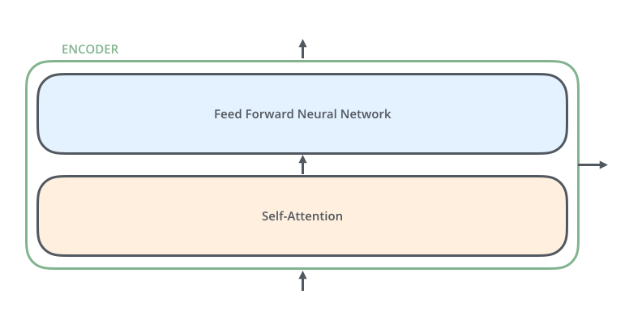

# Introduction
## Resources
- [The Illustrated Transformer](https://jalammar.github.io/illustrated-transformer/)
- [Attention is All You Need](https://arxiv.org/abs/1706.03762)

## Applications
- **NLP** - The main area is for sure everything that concerns Natural Language Processing, where Transformers were born
- **CV** - Transformers have been also tested in Computer Vision field with promising results

# Architecture
## General
The basic architecture of a Transformer is composed by **Encoders** and **Decoders**.

In the original paper were used 6 Encoder blocks and 6 Decoder blocks.

There are of course many alternatives:
- **Decoders Only** - Like GPT-3 and GPT-2
- **Encoders Only** - Like BERT

The above alternatives may also vary for the number of Encoder and/or Decoder blocks used: 
- BERT has 24 Encoder blocks
- GTP-2 has 32 Decoder blocks

## Input
### Tokens
The input of a Transformer, and in general of each Neural Network, is a Tensor. In this case, it is obtained from the input
text through an **Embedding Algorithm**.

The embedded input is also called as *Tokens* and its length depends on the Transformer architecture.

Usually, if the input text is not long enough, **Padding** is used to fill the missing tokens.

It is also important to know that there are *Special* tokens used by the Neural Network to mark:
- [CLS] or 101 - Start of the sentence
- [SEP] or 102 - Separator of sentences
- [MASK] or 103 - Mask token for MLM (Masked Language Model)

### Vocabulary
It is important to notice that, when for example the word *"The"* is tokenized into the token *"464"*,
this number is actually an index to an **Embedding Matrix**.

The model holds an **Embedding Matrix** in which each word is represented to a Tensor of, let's say, 768 dimension.

GPT-2 has a 50.257 x 768 vocabulary:
- 50.257 words
- 768 dimension (each word is represented through 768 numbers)

## Encoder
The *Encoder* block is composed by a **Self-Attention** layer and a **Feed Forward Neural Network**.

### Positional Encoder
It is a technique used to store the original positions of tokens within a sequence. In this way, the tokens can
also be processed in parallel while preserving the original position.

The most common technique is to add a fixed-length vectors to the input embeddings of each token. 
These vectors are designed to represent the position of the token in the sequence.

## Decoder
It has a similar architecture that an encoder block, but with an additional layer in the middle to
help focus on relevant part of the input sentence.

# Attention Mechanism
## Key Concept
It is a mechanism that allows the model to look at other positions in the input sequence to get a 
better understanding of token.

Consider the sentence *"The animal didn't cross the street because it was too tired"*

The word *"it"* refers to the *"Animal"*:

# Dot-Product Attention
## Definition
It is another kind of attention mechanism, together with Self-Attention and Cross-Attention. 
Let’s see an example for text translation with the below architecture of Encoder (left) and Decoder (right).

## Processing
There would be three vectors to compare:
- **Values (V)** and **Keys (K)** derived from the input sentence in english
- **Query (Q)** derived from the input sentence in italian

Notice that, in order to match the length of the english sentence (4), 
a padding token has been added at the end of the italian sentence, 
whose original size was 3.
The Dot-Product is computed between K and Q and then passed to a Softmax function. 
Finally, in order to compute the Dot-Product attention z, the Dot-Product is 
computed between V and the vector resulting from the Softmax function.
This dot product would result in very similar values for the token that match together: 
*Hello - Ciao, How*. 

# Self-Attention
## Definition
It has the same exact process as in the **Dot-Product Attention**. 

However here the vectors V, K and Q are built from the same exact input 
sentence and the attention is computed only for tokens in the past of the sentence, 
never in the future.

## Key Concept

This is the most important aspect of Transformer that differentiate it from traditional sequence models. 
Upon having a sequence of different tokens, like tensor `[18, 47, 56, 57, 58,  1, 15, 47, 58]`, 
the model will start constructing a matrix (**Attention Matrix**) of dimension *Token size x Token size* 
(9 x 9 in our example). Each element of this matrix is going to be the weight that the specific token 
`i` would assign to another token `j`, depending on the importance it would give to the token `j`. 
The value `-inf` or `0 would reflect the fact that the token can not` communicate with that token 
because it is in the future of the sequence.`

## Processing
### Step 1 - Compute Query, Key and Value Tensors
From a single input tensor of tokens, three other tensors are generated:
- **1. Query Tensor**
- **2. Key Tensor**
- **3. Value Tensor**

Such three tensors are generated by multiplying the input tensor for three matrices that has been created during
the training process.

### Step 2 - Compute Self-Attention
For each token in the input sequence, the *Attention Score* with respect to each
other token is computed.

That is computed by the dot-product of the **Query Tensor** and the **Key Tensor**
of that token:
- q_1 * k_1
- q_1 * k_2
- ...
- q_1 * k_n

### Step 3 - Standardisation
Standardise the *Attention Score* by, let's say, the square dimension of the tensors.

### Step 4 - Softmax Function
Pass the standardised attention score in Softmax function to normalise it.

### Step 5 - Retrieve Relevant Tokens
Multiply the value vector by the Softmax score, in order to retrieve relevant tokens.

### Step 6 - Compute Self-Attention
Sum up the weighted value vectors to obtain the self-attention matrix.

## Aggregated Weighted Context
It is one of the first approach for of *Self-Attention*.

Consider the sequence: `[18, 47, 56, 57, 58,  1, 15, 47, 58]`

While training the token `56`, the algorithm should retrieve its context `[18, 47]` in order 
to learn the next token `57`. Passing the whole context everytime is expensive. 
That’s why in Transformer architecture, it’s better to pass a more concise representation of the previous 
context: an **aggregated weighted context**. 

A very simplified version adopts just the average:
> Token: `56`
> 
> Context: `[18, 47]` &rarr; `41.5` (avg)
> 
> Target: `57`

# Multi-Head Attention
## Comparison with Single-Head Attention
1. It expands the model’s ability to focus on different positions.
2. It has multiple representation subspaces by using multiple Query, Key and Value vectors. It is used to
project the input embeddings into multiple subspaces.

## Process
Given the multiple Query, Key and Value vectors in the Self-Attention layer, there is the need
to condense all of them into a single one, in order to be fed to the Feed Forward layer.

They are concatenated and multiplied by a weight matrix.

# Training Process
## Goal
Given an input sequence of tokens (e.g., words), predict the next token.

# Inference Process
## Projecting the Output
The Transformer network works through the following step
1. Transform input text into token IDs
2. Feed the token IDs into the Transformer
3. Hidden State is a tensor of probabilities with the dimension of the Transformer vocabulary

At this point, into order to transform the number back to a text, the network picks up the max probability through a Softmax function
from the hidden state tensor, which will correspond to a word in the vocabulary.
