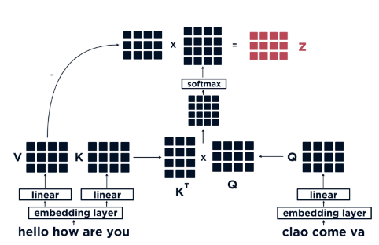

# Introduction
## Resources
- [The Illustrated Transformer](https://jalammar.github.io/illustrated-transformer/)
- [Attention is All You Need](https://arxiv.org/abs/1706.03762)

# Architecture
The basic architecture of a Transformer is composed by **Encoders** and **Decoders**.

## Input
The input of a Transformer, and in general of each Neural Network, is a Tensor. In this case, it is obtained from the input
text through an **Embedding Algorithm**.

The embedded input is also called as *Tokens* and its length depends on the Transformer architecture.

Usually, if the input text is not long enough, **Padding** is used to fill the missing tokens.

It is also important to know that there are *Special* tokens used by the Neural Network to mark:
- [CLS] or 101 - Start of the sentence
- [SEP] or 102 - Separator of sentences
- [MASK] or 103 - Mask token for MLM (Masked Language Model)

## Encoder
It is composed by a **Self-Attention** layer and a **Feed Forward Neural Network**.

### Positional Encoder
It is a technique used to store the original positions of tokens within a sequence. In this way, the tokens can
also be processed in parallel while preserving the original position.

The most common technique is to add a fixed-length vectors to the input embeddings of each token. 
These vectors are designed to represent the position of the token in the sequence.

## Decoder
It has a similar architecture that an encoder, but with an additional layer in the middle to
help focus on relevant part of the input sentence.

# Dot-Product Attention
## Definition
It is another kind of attention mechanism, together with Self-Attention and Cross-Attention. 
Let’s see an example for text translation with the below architecture of Encoder (left) and Decoder (right).

## Processing
There would be three vectors to compare:
- **Values (V)** and **Keys (K)** derived from the input sentence in english
- **Query (Q)** derived from the input sentence in italian

Notice that, in order to match the length of the english sentence (4), 
a padding token has been added at the end of the italian sentence, 
whose original size was 3.
The Dot-Product is computed between K and Q and then passed to a Softmax function. 
Finally, in order to compute the Dot-Product attention z, the Dot-Product is 
computed between V and the vector resulting from the Softmax function.
This dot product would result in very similar values for the token that match together: 
*Hello - Ciao, How*. 

# Self-Attention
## Definition
It is a mechanism that allows the model to look at other positions in the input sequence to get a 
better understanding of token.

Consider the sentence *"The animal didn't cross the street because it was too tired"*

The word *"it"* refers to the *"Animal"*:

## Processing
It has the same exact process as in the **Dot-Product Attention**. 
However here the vectors V, K and Q are built from the same exact input 
sentence and the attention is computed only for tokens in the past of the sentence, 
never in the future.

This is the most important aspect of Transformer that differentiate it from traditional sequence models. 
Upon having a sequence of different tokens, like tensor `[18, 47, 56, 57, 58,  1, 15, 47, 58]`, 
the model will start constructing a matrix (**Attention Matrix**) of dimension *Token size x Token size* 
(9 x 9 in our example). Each element of this matrix is going to be the weight that the specific token 
`i` would assign to another token `j`, depending on the importance it would give to the token `j`. 
The value `-inf` or `0 would reflect the fact that the token can not` communicate with that token 
because it is in the future of the sequence.`

## Aggregated Weighted Context
It is one of the first approach for of *Self-Attention*.

Consider the sequence: `[18, 47, 56, 57, 58,  1, 15, 47, 58]`

While training the token `56`, the algorithm should retrieve its context `[18, 47]` in order 
to learn the next token `57`. Passing the whole context everytime is expensive. 
That’s why in Transformer architecture, it’s better to pass a more concise representation of the previous 
context: an **aggregated weighted context**. 

A very simplified version adopts just the average:
> Token: `56`
> 
> Context: `[18, 47]` &rarr; `41.5` (avg)
> 
> Target: `57`