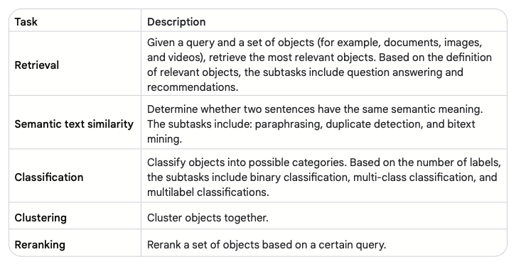

# Vector Search
## Definition
Full-text keyword search has been the lynchpin of modern IT systems for years.

However, if the
key word is misspelled or described with a differently worded text, a traditional keyword
search returns incorrect or no results.

This is where vector search is
very powerful: it uses the vector or embedded semantic representation of documents.

## Process
After you have a function that can compute embeddings of various items, you
compute the embedding of the items of interest and store this embedding in a database.
You then embed the incoming query in the same vector space as the items. Next, you have
to find the best matches to the query. This process is analogous to finding the most ‘similar’
matches across the entire collection of searchable vectors: similarity between vectors can be
computed using a metric such as euclidean distance, cosine similarity, or dot product.

## Vector Search Algorithms
### Introduction
The most straightforward way to find the most similar match is to run a traditional linear
search by comparing the query vector with each document vector and return the one with
the highest similarity. However, the runtime of this approach scales linearly (O(N)) with the
amount of documents or items to search. This approach is unacceptably slow for most use
cases involving several millions of documents or more. Using approximate nearest neighbour
(ANN) search for that purpose is more practical. ANN is a technique for finding the closest
points to a given point in a dataset with a small margin of error.

### Locality Sensitive Hashing (LSH)
Locality sensitive hashing (LSH) 28 is a technique for finding similar items in a large dataset.
It does this by creating one or more hash functions that map similar items to the same hash
bucket with high probability.

The number of hash functions/tables and buckets
determine the search recall/speed tradeoff, as well as the false positive / true positive one.
Having too many hash functions might cause similar items to different buckets, while too few
might result in too many items falsely being hashed to the same bucket and the number of
linear searches to increase.

```python
from sklearn.neighbors import NearestNeighbors
from vertexai.language_models import TextEmbeddingModel
from lshashing import LSHRandom
import numpy as np

model = TextEmbeddingModel.from_pretrained("textembedding-gecko@004")

test_items= [
"The earth is spherical.",
"The earth is a planet.",
"I like to eat at a restaurant."]

query = "the shape of earth"

embedded_test_items = np.array([embedding.values for embedding in model.get_embeddings(test_items)])
embedded_query = np.array(model.get_embeddings([query])[0].values)

#Naive brute force search
n_neighbors=2
nbrs = NearestNeighbors(n_neighbors=n_neighbors, algorithm='brute').fit(embedded_test_items)
naive_distances, naive_indices = nbrs.kneighbors(np.expand_dims(embedded_query, axis = 0))

#algorithm- ball_tree due to high dimensional vectors or kd_tree otherwise
nbrs = NearestNeighbors(n_neighbors=n_neighbors, algorithm='ball_tree').fit(embedded_test_items)
distances, indices = nbrs.kneighbors(np.expand_dims(embedded_query, axis = 0))

#LSH
lsh_random_parallel = LSHRandom(embedded_test_items, 4, parallel = True)
lsh_random_parallel.knn_search(embedded_test_items, embedded_query, n_neighbors, 3, parallel = True)

#output for all 3 indices = [0, 1] , distances [0.66840428, 0.71048843] for the first 2 neighbours
#ANN retrieved the same ranking of items as brute force in a much scalable manner
```

### FAISS
One of the FAISS (Facebook AI similarity search) implementations leverages the concept
of hierarchical navigable small world (HNSW) 31 to perform vector similarity search in sub-
linear (O(Logn)) runtime with a good degree of accuracy. A HNSW is a proximity graph with a
hierarchical structure where the graph links are spread across different layers. The top layer
has the longest links and the bottom layer has the shortest ones. As shown in Figure 9, the
search starts at the topmost layer where the algorithm greedily traverses the graph to find
the vertex most semantically similar to the query. Once the local minimum for that layer is
found, it then switches to the graph for the closest vertex on the layer below.

### ScaNN
The first step is the optional partitioning step during training: it uses one of the multiple
algorithms available to partition the vector store into logical partitions/clusters where
the semantically related are grouped together.

At query time ScaNN uses the user-specified distance measure to select the specified
number of top partitions (a value specified by the user), and then executes the scoring
step next.

Finally, as a last step the user can optionally choose to rescore the user specified top K
number of results more accurately.

## Vector Databases
### Definition
Each vector database differs in its implementation, but the general flow is:

1. An appropriate trained embedding model is used to embed the relevant data points as
vectors with fixed dimensions.
2. The vectors are then augmented with appropriate metadata and complementary
information (such as tags) and indexed using the specified algorithm for efficient search.
3. An incoming query gets embedded with the same model, and used to query and return
specific amounts of the most semantically similar items and their associated unembedded
content/metadata. Some databases might provide caching and pre-filtering (based on
tags) and post-filtering capabilities (reranking using another more accurate model) to
further enhance the query speed and performance.

### Challenges
1. Embeddings, unlike traditional content, can mutate over time. However, frequently updating the embeddings 
especially those trained on large amounts of data - can be prohibitively expensive.
2. While embeddings are great at representing semantic information, sometimes they
can be suboptimal at representing literal or syntactic information. This is especially true for
domain-specific words or IDs.

## Applications
### Overview



### RAG
Retrieval augmented generation (RAG) for Q&A is a technique that combines the best of both
worlds from retrieval and generation. It first retrieves relevant documents from a knowledge
base and then uses prompt expansion to generate an answer from those documents. Prompt
expansion is a technique that when combined with database search can be very powerful.
With prompt expansion the model retrieves relevant information from the database (mostly
using a combination of semantic search and business rules), and augments the original
prompt with it.

RAGs can help with a common problem with LLMs: their tendency to ‘hallucinate’